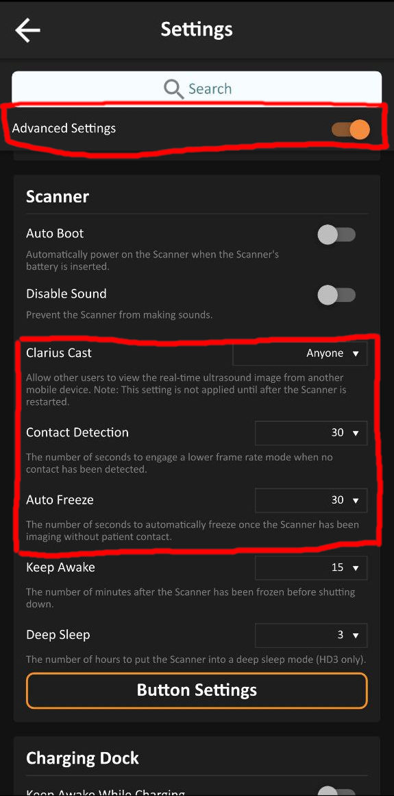
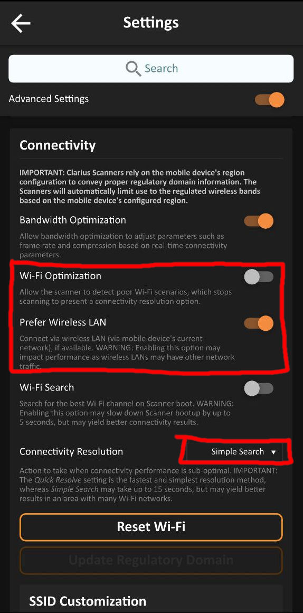
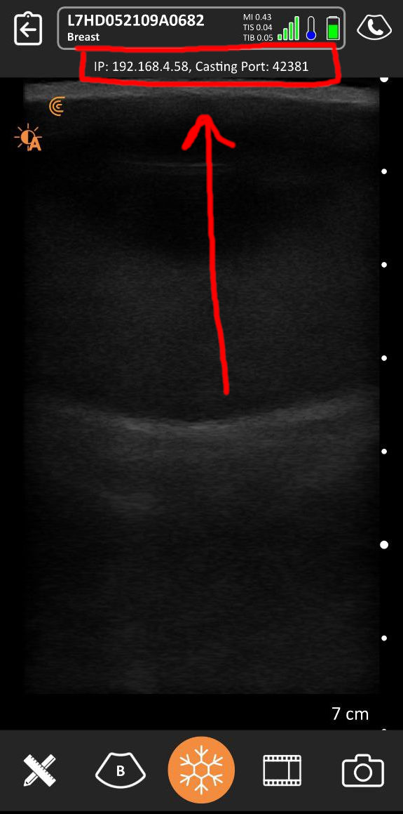

# ClariusOpenIGTLinkBridge
Simple command line tool that connects to a Clarius probe using [Clarius Cast API](https://github.com/clariusdev/cast) and streams the ultrasound frames through [OpenIGTLink](http://openigtlink.org/).

## Clarius Probe Setup
In the Clarius app insert the following settings, in order to enable the Cast API and to
prevent the probe from creating its own Wi-Fi hotspot.

After that, when connecting to a probe you should be able to see the IP and port used for streaming:

## Usage
Start the program specifying the IP and port shown in the Clarius app `./ClariusOpenIGTLinkBridge <ip> <port>`.

The program will connect to the probe and will print a line showing the IGTLink server port `Created IGTLink server on port: 8080`.

## Updating Cast API Version
The Cast API used in this program must be the same as the version of the Clarius app running on the phone/tablet.
If the versions are different you can update this repo by following these steps: 
 - In the Clarius app, open the left menu and click on "System Status", you can find the "Software Version" under "System Information". 
 - Go to the [Clarius Cast Releases page](https://github.com/clariusdev/cast/releases) and find your version.
 - Download the library zip file for your OS and the source code.
 - This repository contains Cast libraries in the folder `Cast/<version>/<os name>/lib`. Create this folder structure for the version you need and copy the libraries (`libcast.so` for Linux, `cast.dll` and `cast.lib` for Windows) contained in the zip file into it. 
- This repository contains Cast includes in the folder `Cast/<version>/<os name>/include`. Create this folder structure for the version you need and copy the headers from the source code zip file you downloaded from the [Clarius Cast Releases page](https://github.com/clariusdev/cast/releases).
- Inside the `CMakeLists.txt` change the line `set(CAST_VERSION 10.3.0)` to the required version.
- Recompile this project.